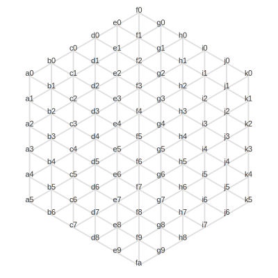
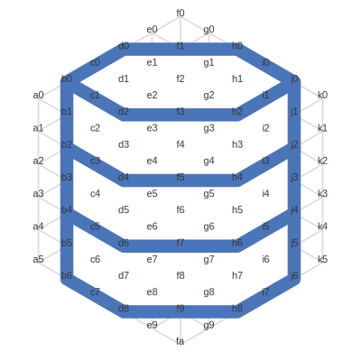

# glyph [](https://github.com/k1LoW/glyph/actions)

<p align="center">

</p>

> "Icon as Code"

`glyph` is a embedded icon framework.

## Concept

`glyph` generates icons by connecting predefined coordinates with lines.



``` go
package main

import (
	"os"
	"strings"

	"github.com/k1LoW/glyph"
)

func main() {
	g, _ := glyph.New()
	_ = g.Line(strings.Split("b0 d0 h0 j0 j6 h8 d8 b6 b0", " "))
	_ = g.Line(strings.Split("b0 d2 h2 j0", " "))
	_ = g.Line(strings.Split("b2 d4 h4 j2", " "))
	_ = g.Line(strings.Split("b4 d6 h6 j4", " "))
	_ = g.Write(os.Stdout)
}
```

## Included Icon Set

`glyph` has [included icon set](included.md).

``` go
package main

import (
	"os"
	"strings"

	"github.com/k1LoW/glyph"
)

func main() {
	g, _ := glyph.Included().Get("browser")
	_ = g.Write(os.Stdout)
}
```
