# Included Icon Set

| Name | Icon (SVG) | Icon (PNG) | Icon (Custom color) |
| ---- | ---- | ---- | ---- |
| blocks |  |  |  |
| blocks2 |  |  |  |
| browser |  |  |  |
| clock ( img/included/clock_cc.svg ) |  |  |  |
| cloud |  |  |  |
| cube |  | 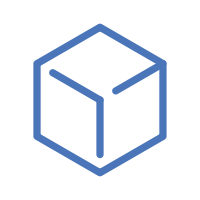 |  |
| cube2 |  |  |  |
| cube3 |  |  |  |
| cube4 |  |  |  |
| cube5 |  |  |  |
| cubes |  |  |  |
| cubes2 |  | 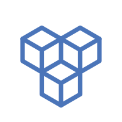 |  |
| cubes3 |  |  |  |
| db ( img/included/db_cc.svg ) |  |  |  |
| db2 ( img/included/db2_cc.svg ) |  |  |  |
| db3 ( img/included/db3_cc.svg ) |  |  |  |
| db4 ( img/included/db4_cc.svg ) |  |  |  |
| doc ( img/included/doc_cc.svg ) |  |  |  |
| gear |  |  |  |
| globe | 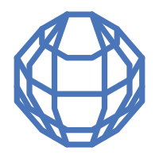 |  |  |
| hex ( img/included/hex_cc.svg ) |  |  |  |
| hex2 ( img/included/hex2_cc.svg ) |  |  |  |
| key |  |  |  |
| lb |  |  |  |
| lb-l4 | 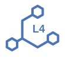 | 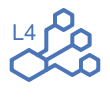 | 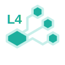 |
| lb-l7 | 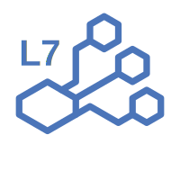 |  | 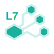 |
| lock |  |  |  |
| metrics |  |  |  |
| monitor |  |  |  |
| monitor2 |  |  |  |
| pen |  |  |  |
| pen2 ( img/included/pen2_cc.svg ) |  |  |  |
| proxy |  |  |  |
| queue ( img/included/queue_cc.svg ) | 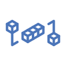 | 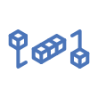 | 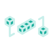 |
| queue2 ( img/included/queue2_cc.svg ) |  |  |  |
| server |  |  |  |
| servers |  |  |  |
| shield |  |  |  |
| terminal |  |  |  |
| text ( img/included/text_cc.svg ) |  |  |  |
| unlock |  |  |  |
| user |  |  |  |
