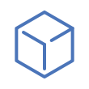
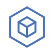
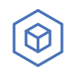
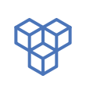

# Included Icon Set

| Name | Icon (SVG) | Icon (PNG) |
| ---- | ---- | ---- |
| blocks |  |  |
| browser |  |  |
| clock ( timer ) |  |  |
| cloud |  |  |
| cube |  |  |
| cube2 |  |  |
| cube3 |  |  |
| cube4 |  |  |
| cube5 |  |  |
| cubes |  |  |
| cubes2 |  |  |
| db ( database ) |  |  |
| db2 ( database2 ) |  |  |
| db3 ( database3 ) |  |  |
| db4 ( database4 ) |  |  |
| doc ( document ) |  |  |
| gear |  |  |
| globe |  |  |
| hex ( hexagon ) |  |  |
| hex2 ( hexagon2 ) |  |  |
| key |  |  |
| lb |  |  |
| lb-l4 |  |  |
| lb-l7 |  |  |
| lock |  |  |
| metrics |  |  |
| monitor |  |  |
| monitor2 |  |  |
| pen |  |  |
| pen2 ( write ) |  |  |
| proxy |  |  |
| queue ( fifo ) |  |  |
| queue2 ( lifo ) |  |  |
| shield |  |  |
| terminal |  |  |
| text ( page ) |  |  |
| unlock |  |  |
