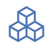
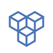

# Included Icon Set

| Name | Icon |
| ---- | ---- |
| blocks |  |
| browser |  |
| cloud |  |
| cube |  |
| cube2 |  |
| cube3 |  |
| cube4 |  |
| cube5 |  |
| cubes |  |
| cubes2 |  |
| db ( database ) |  |
| doc ( document ) |  |
| gear |  |
| globe |  |
| hex ( hexagon ) |  |
| hex2 ( hexagon2 ) |  |
| lb |  |
| lb-l4 |  |
| lb-l7 |  |
| metrics |  |
| proxy |  |
| shield |  |
| terminal |  |
